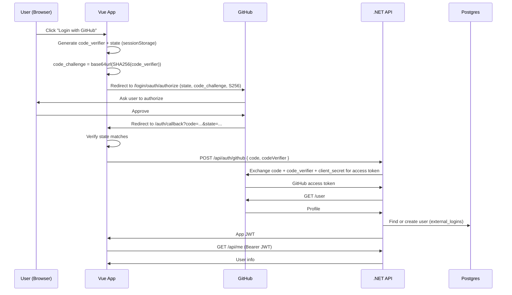

# oauth-learn

A hands-on learning project that implements **"Login with GitHub"** using the **OAuth 2.0 Authorization Code flow with PKCE**, with a Vue 3 frontend and a .NET 10 backend.

> This is a learning project, not production software. The goal is to understand every hop of the flow, not to ship a polished app.

## What this project demonstrates

- OAuth 2.0 authorization code flow
- PKCE (S256): code verifier and code challenge generated in the browser
- `state` parameter validation for CSRF protection
- Server-side code exchange so the **client secret never reaches the browser**
- Issuing the app's own JWT after GitHub authenticates the user
- Protected API endpoints and frontend route guards
- EF Core code-first with PostgreSQL

## Tech stack

| Layer | Technology |
|---|---|
| Frontend | Vue 3, Vite, Vue Router, Pinia, Axios |
| Backend | .NET 10 Web API (controllers), JWT Bearer auth |
| Database | PostgreSQL 17 (Docker), EF Core + Npgsql, code-first migrations |
| Identity provider | GitHub OAuth App |

## How the flow works



Key design decisions:

1. **Vue starts the flow and handles PKCE and `state`.** This keeps the PKCE logic visible and easy to study.
2. **.NET performs the code exchange.** The GitHub client secret stays on the server, and GitHub's token never reaches the browser.
3. **The API issues its own JWT.** The app's session is independent of GitHub's token.
4. **Users are matched on GitHub's numeric user ID**, not email, because GitHub emails can be private or change.

## Project structure

```
oauth-learn/
├── api/                  # .NET 10 Web API
├── web/                  # Vue 3 + Vite frontend
├── docker-compose.yml    # PostgreSQL
├── .env.example          # Template for compose variables
└── README.md
```

## Prerequisites

- [.NET SDK 10](https://dotnet.microsoft.com/download)
- [Node.js LTS](https://nodejs.org/)
- [Docker](https://www.docker.com/)
- `dotnet-ef` tool: `dotnet tool install --global dotnet-ef`
- A GitHub account

## Setup

### 1. Register a GitHub OAuth App

Go to **GitHub → Settings → Developer settings → OAuth Apps → New OAuth App** and use:

| Field | Value |
|---|---|
| Application name | `oauth-learn-local` |
| Homepage URL | `http://localhost:5173` |
| Authorization callback URL | `http://localhost:5173/auth/callback` |

Copy the **Client ID** and generate a **Client Secret**. The secret is shown only once.

### 2. Clone the repository

```bash
git clone https://github.com/<your-username>/oauth-learn.git
cd oauth-learn
```

### 3. Start PostgreSQL

```bash
cp .env.example .env        # then set PG_PASSWORD in .env
docker compose up -d
```

PostgreSQL is exposed on **localhost:5433** to avoid clashing with a local Postgres on 5432.

### 4. Configure the API secrets

Secrets are stored with .NET user-secrets, never in the repository:

```bash
cd api
dotnet user-secrets init
dotnet user-secrets set "ConnectionStrings:Default" "Host=localhost;Port=5433;Database=authlearn;Username=app;Password=<PG_PASSWORD>"
dotnet user-secrets set "GitHub:ClientId" "<your-client-id>"
dotnet user-secrets set "GitHub:ClientSecret" "<your-client-secret>"
dotnet user-secrets set "Jwt:SigningKey" "<random-string-of-at-least-32-characters>"
```

### 5. Apply database migrations

```bash
dotnet ef database update
```

### 6. Configure the frontend

Create `web/.env.local`:

```env
VITE_GITHUB_CLIENT_ID=<your-client-id>
VITE_GITHUB_REDIRECT_URI=http://localhost:5173/auth/callback
```

The client ID is public. **Never put the client secret in the frontend.**

## Running the app

In two terminals:

```bash
# Terminal 1: API (http://localhost:5080)
cd api
dotnet run

# Terminal 2: Frontend (http://localhost:5173)
cd web
npm install
npm run dev
```

Open http://localhost:5173 and click **Login with GitHub**.

Vite proxies `/api` to the .NET API during development, so no CORS configuration is needed locally.

## API endpoints

| Method | Route | Auth | Description |
|---|---|---|---|
| POST | `/api/auth/github` | None | Exchanges `{ code, codeVerifier }` with GitHub, finds or creates the user, returns the app JWT |
| GET | `/api/me` | Bearer JWT | Returns the current user's profile |

## Database schema

| Table | Purpose |
|---|---|
| `users` | The app's own user record (id, email, display name, avatar, created at) |
| `external_logins` | Links a provider account to a user. Unique index on `(provider, provider_user_id)` |

## Configuration reference

| Where | Key | Secret |
|---|---|---|
| user-secrets | `ConnectionStrings:Default` | Yes |
| user-secrets | `GitHub:ClientId` | No |
| user-secrets | `GitHub:ClientSecret` | **Yes** |
| user-secrets | `Jwt:SigningKey` | **Yes** |
| appsettings | `Jwt:Issuer`, `Jwt:Audience` | No |
| `web/.env.local` | `VITE_GITHUB_CLIENT_ID`, `VITE_GITHUB_REDIRECT_URI` | No |
| `.env` | `PG_PASSWORD` | Yes |

## Security notes

- The GitHub **client secret** and the **JWT signing key** exist only on the server.
- PKCE uses the **S256** method only. GitHub does not accept `plain`.
- `state` and `code_verifier` are stored in `sessionStorage` and deleted after the callback.
- Authorization codes are single-use and short-lived. Replaying one fails.
- The app JWT is short-lived. Tokens in browser storage are readable by XSS, so a production app should consider a strict BFF with httpOnly cookies (see Roadmap).
- Verifier and `state` generation use `crypto.getRandomValues`, never `Math.random`.

## Things I broke on purpose (and why each failed)

| Experiment | What stopped it |
|---|---|
| Tampered `state` | Frontend state check |
| Wrong `code_verifier` | GitHub's PKCE verification |
| Reused authorization code | Codes are single-use |
| Wrong redirect URI | GitHub's redirect URI matching |
| Tampered JWT | Signature validation |
| Expired JWT | Lifetime validation |

_Fill this in with your own observations._

## Roadmap

- [ ] Refresh tokens (access token in memory + rotating refresh token in an httpOnly cookie)
- [ ] Strict BFF version using `AddOAuth` and cookie authentication
- [ ] Run my own authorization server (Keycloak or OpenIddict) to learn OIDC, ID tokens, and JWKS
- [ ] Add a second provider (Google) linked through `external_logins`
- [ ] Refactor to Clean Architecture layers

## Learning resources

- [RFC 6749: OAuth 2.0, section 4.1](https://datatracker.ietf.org/doc/html/rfc6749#section-4.1)
- [RFC 7636: PKCE](https://datatracker.ietf.org/doc/html/rfc7636)
- [RFC 9700: OAuth 2.0 Security Best Current Practice](https://datatracker.ietf.org/doc/html/rfc9700)
- [GitHub Docs: Authorizing OAuth apps](https://docs.github.com/en/apps/oauth-apps/building-oauth-apps/authorizing-oauth-apps)

