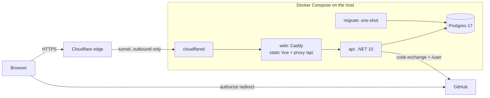
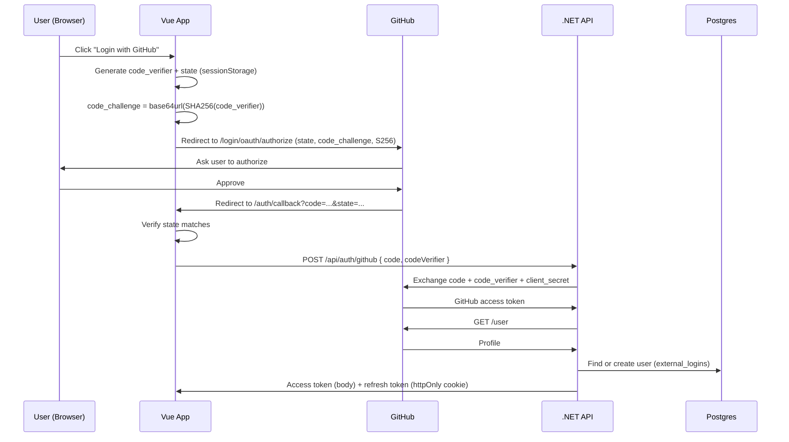
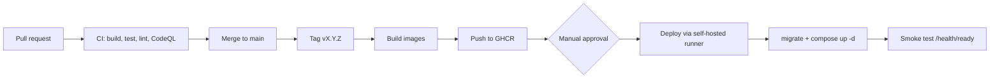

# oauth-learn

**"Login with GitHub"** implemented with the **OAuth 2.0 Authorization Code flow + PKCE**, built with Vue 3 and .NET 10, containerized, 

## Project status

This README describes the target state of the project. Tick each phase as you finish it.

| Phase | Scope | Status |
|---|---|---|
| 1. Build | OAuth + PKCE flow, EF Core code-first, JWT session | ☐ |
| 2. Harden | Refresh tokens (httpOnly cookie), rate limiting, health checks, structured logs, tests | ☐ |
| 3. Containerize | Dockerfiles, production Compose, CI pipeline | ☐ |
| 4. Deploy | Cloudflare Tunnel, CD pipeline, backups, runbook | ☐ |

## Features

- OAuth 2.0 authorization code flow with **PKCE (S256)** and **`state`** validation
- Client secret stays server-side; GitHub's token never reaches the browser
- App-issued short-lived **access token held in memory**, plus a **rotating refresh token in an httpOnly cookie** with reuse detection
- Users matched by GitHub's numeric ID (not email) through an `external_logins` table
- Single-origin deployment: no CORS in production
- Rate-limited auth endpoints, security headers (HSTS, CSP), non-root containers
- Liveness and readiness health endpoints, structured JSON logs
- Versioned container images, CI on every PR, approval-gated deploys, nightly backups

## Tech stack

| Layer | Technology |
|---|---|
| Frontend | Vue 3, Vite, Vue Router, Pinia, Axios, Vitest |
| Backend | .NET 10 Web API (controllers), JWT Bearer auth, built-in rate limiter |
| Database | PostgreSQL 17, EF Core + Npgsql (code-first migrations) |
| Edge / serving | Caddy (static files + reverse proxy), Cloudflare Tunnel |
| Containers | Docker, Docker Compose, GHCR |
| CI/CD | GitHub Actions, CodeQL, Dependabot |
| Tests | xUnit, `WebApplicationFactory`, Testcontainers |

## Architecture



No service publishes a host port. The only way in is the Cloudflare Tunnel, which makes an outbound connection.

### Login flow



### Session model

| Token | Lifetime | Stored | Purpose |
|---|---|---|---|
| Access token (JWT) | ~15 minutes | Browser **memory only** | Authorizes API calls |
| Refresh token (opaque) | Days (configurable) | httpOnly + Secure + SameSite=Strict cookie; **SHA-256 hash** in the database | Silently obtains a new access token |

Each refresh rotates the token. Replaying an old refresh token revokes the whole token family.

### Design decisions

1. **Vue starts the flow and handles PKCE and `state`.** The client secret never touches the browser.
2. **.NET performs the code exchange.** GitHub's token stays on the server and is discarded after the profile is read.
3. **Same origin in every environment.** Vite proxies `/api` in development; Caddy does it in production. The frontend only uses relative `/api/...` URLs.
4. **Users are matched on GitHub's numeric ID**, because GitHub emails can be private or change.
5. **Migrations run as a one-shot container** during deploy, never from a developer laptop.

## Repository layout

```
oauth-learn/
├── api/                        # .NET 10 Web API
├── api.tests/                  # Unit and integration tests
├── web/                        # Vue 3 + Vite
├── deploy/
│   ├── docker-compose.prod.yml
│   ├── Caddyfile
│   ├── .env.example
│   └── scripts/                # backup.sh, restore.sh, deploy.sh
├── .github/
│   ├── workflows/ci.yml
│   ├── workflows/cd.yml
│   └── dependabot.yml
├── docker-compose.yml          # Dev: Postgres only
├── CHANGELOG.md
└── README.md
```

## Environments

| Environment | URL | GitHub OAuth App |
|---|---|---|
| Development | `http://localhost:5173` | `oauth-learn-dev` |
| Local production-like stack | `http://localhost:8080` | `oauth-learn-stack` |
| Production | `https://auth.<your-domain>` | `oauth-learn-prod` |

Use a separate OAuth App and separate secrets for each environment.

---

## Local development

### Prerequisites

- .NET SDK 10
- Node.js LTS
- Docker
- `dotnet-ef`: `dotnet tool install --global dotnet-ef`
- A GitHub account

### 1. Register the dev OAuth App

**GitHub → Settings → Developer settings → OAuth Apps → New OAuth App**

| Field | Value |
|---|---|
| Application name | `oauth-learn-dev` |
| Homepage URL | `http://localhost:5173` |
| Authorization callback URL | `http://localhost:5173/auth/callback` |

Copy the Client ID and generate a Client Secret (shown only once).

### 2. Start Postgres

```bash
cp .env.example .env        # set PG_PASSWORD
docker compose up -d        # Postgres on localhost:5433
```

### 3. Configure API secrets

```bash
cd api
dotnet user-secrets init
dotnet user-secrets set "ConnectionStrings:Default" "Host=localhost;Port=5433;Database=authlearn;Username=app;Password=<PG_PASSWORD>"
dotnet user-secrets set "GitHub:ClientId" "<client-id>"
dotnet user-secrets set "GitHub:ClientSecret" "<client-secret>"
dotnet user-secrets set "Jwt:SigningKey" "<random-string-of-at-least-32-characters>"
dotnet ef database update
```

### 4. Configure the frontend

Create `web/.env.local`:

```env
VITE_GITHUB_CLIENT_ID=<client-id>
VITE_GITHUB_REDIRECT_URI=http://localhost:5173/auth/callback
```

### 5. Run

```bash
# Terminal 1: API on http://localhost:5080
cd api && dotnet run

# Terminal 2: frontend on http://localhost:5173
cd web && npm install && npm run dev
```

### Run the tests

```bash
dotnet test        # unit + integration (Testcontainers needs Docker running)
cd web && npm test
```

---

## Production deployment

The production stack is defined in `deploy/docker-compose.prod.yml`: `db`, `migrate` (one-shot), `api`, `web` (Caddy), and `cloudflared`.

### One-time setup

1. **Domain and tunnel:** add your domain to Cloudflare, create a Cloudflare Tunnel, and add a public hostname `auth.<your-domain>` pointing to `http://web:80`. Copy the tunnel token.
2. **Production OAuth App:** register `oauth-learn-prod` with callback `https://auth.<your-domain>/auth/callback`.
3. **Secrets:** generate a **new** client secret, JWT signing key, and database password for production. Store them in Infisical, or in `deploy/.env` on the server (`chmod 600`, never committed). Start from `deploy/.env.example`.
4. **Build-time frontend config:** the production web image must be built with the production `VITE_GITHUB_CLIENT_ID` and `VITE_GITHUB_REDIRECT_URI` (CI passes them as build args).
5. **Host settings:** keep the host awake and make sure Docker starts on boot. All services use `restart: unless-stopped`.

### Manual deploy

```bash
cd deploy
export TAG=v1.0.0
docker compose -f docker-compose.prod.yml pull
docker compose -f docker-compose.prod.yml up -d
curl -fsS https://auth.<your-domain>/api/health/ready
```

(Adjust the health URL to match how you expose the endpoint through the proxy.)

On `up`, the `migrate` container applies pending EF Core migrations first, and the API starts only after it completes successfully.

### Automated deploy (CI/CD)



- **CI** (`ci.yml`) runs on every pull request and push to `main`: build, tests, lint, `dotnet format --verify-no-changes`, Docker build check. CodeQL, Dependabot, and secret scanning are enabled, and CI is a required check on `main`.
- **CD** (`cd.yml`) runs on version tags: builds `linux/arm64` images, pushes them to GHCR tagged with the version and commit SHA, then waits for approval in the `production` environment before deploying.
- The deploy job runs on a **self-hosted runner** on the host (outbound connection only). It never runs on pull requests.
- If the post-deploy smoke test doesn't see a healthy `/health/ready`, the job fails and the release is rolled back (see below).

### Rollback

```bash
cd deploy
export TAG=<previous-version>
docker compose -f docker-compose.prod.yml up -d
```

Migrations are written to stay **backward compatible for one release** (add a column in one release, use it in the next, remove it later), so rolling the app back never breaks the schema.

### Versioning

[Semantic Versioning](https://semver.org/) with Git tags (`v1.2.3`). Changes are recorded in [CHANGELOG.md](CHANGELOG.md) following [Keep a Changelog](https://keepachangelog.com/).

---

## Operations runbook

### Health checks

| Endpoint | Meaning |
|---|---|
| `/health/live` | Process is running |
| `/health/ready` | Process is running **and** can reach Postgres |

### Common tasks

```bash
cd deploy
docker compose -f docker-compose.prod.yml ps                  # status and health
docker compose -f docker-compose.prod.yml logs -f api         # follow API logs
docker compose -f docker-compose.prod.yml restart api         # restart one service
```

### Backups

- `deploy/scripts/backup.sh` runs nightly (via `launchd` or cron): compressed `pg_dump`, retention of the last N days, copied offsite where available.
- `deploy/scripts/restore.sh` restores a dump into a database. **Run a restore test regularly** into a throwaway database.

### Troubleshooting

| Symptom | Likely cause |
|---|---|
| GitHub shows "redirect_uri mismatch" | Callback URL in the OAuth App doesn't exactly match `VITE_GITHUB_REDIRECT_URI` for that environment |
| Login returns to `/login` with an error | `state` mismatch, expired or reused code, or wrong verifier. Check API logs (no secrets are logged) |
| Logged out on every refresh | Refresh cookie missing: check `Secure`/`SameSite`, and that you're on the HTTPS origin |
| Every request rate-limited | API isn't trusting the proxy's forwarded headers, so all clients look like one IP |
| `api` never becomes healthy | Missing or weak config: the app refuses to start when required secrets are absent. Check startup logs |
| Site unreachable but containers healthy | Check the `cloudflared` container logs and the tunnel's public hostname in Cloudflare |

---

## Configuration reference

| Key | Where | Secret |
|---|---|---|
| `ConnectionStrings__Default` | API env / user-secrets | **Yes** |
| `GitHub__ClientId` | API env / user-secrets | No |
| `GitHub__ClientSecret` | API env / user-secrets | **Yes** |
| `Jwt__SigningKey` | API env / user-secrets | **Yes** (32+ random bytes) |
| `Jwt__Issuer`, `Jwt__Audience` | API env / appsettings | No |
| `PG_USER`, `PG_PASSWORD`, `PG_DB` | `deploy/.env` / Infisical | Password: **Yes** |
| `TUNNEL_TOKEN` | `deploy/.env` / Infisical | **Yes** |
| `TAG` | `deploy/.env` / CI | No |
| `VITE_GITHUB_CLIENT_ID`, `VITE_GITHUB_REDIRECT_URI` | Frontend build time | No |

In .NET, `GitHub:ClientId` (user-secrets) and `GitHub__ClientId` (environment variable) are the same setting.

## Database schema

| Table | Purpose |
|---|---|
| `users` | The app's user record (id, email, display name, avatar, created at) |
| `external_logins` | Links a provider account to a user. Unique index on `(provider, provider_user_id)` |
| `refresh_tokens` | Hashed refresh tokens with `family_id`, expiry, revocation and replacement tracking |

## API endpoints

| Method | Route | Auth | Description |
|---|---|---|---|
| POST | `/api/auth/github` | None | Exchanges `{ code, codeVerifier }`, signs the user in, returns an access token and sets the refresh cookie |
| POST | `/api/auth/refresh` | Refresh cookie | Rotates the refresh token and returns a new access token |
| POST | `/api/auth/logout` | Refresh cookie | Revokes the token and clears the cookie |
| GET | `/api/me` | Bearer | Returns the current user's profile |
| GET | `/health/live` | None | Liveness |
| GET | `/health/ready` | None | Readiness (includes Postgres) |

## Security

- HTTPS everywhere; HSTS, CSP, `X-Content-Type-Options`, and `Referrer-Policy` set at the proxy.
- PKCE with **S256** only; `state` validated; authorization codes are single-use.
- Secrets live only in the server-side secret store, separate per environment.
- Refresh tokens are hashed at rest, rotated on use, and revoked as a family on reuse.
- Auth endpoints are rate-limited per client IP (the API trusts forwarded headers only from the proxy network).
- Containers run as non-root, no host ports are published, and the database is reachable only on the internal Docker network.
- Tokens, codes, verifiers, cookies, and secrets are never logged.
- Dependabot, CodeQL, and secret scanning with push protection are enabled.

To report a vulnerability, open a private security advisory on the repository.

## Things I broke on purpose (and why each failed)

| Experiment | What stopped it |
|---|---|
| Tampered `state` | Frontend state check |
| Wrong `code_verifier` | GitHub's PKCE verification |
| Reused authorization code | Codes are single-use |
| Wrong redirect URI | GitHub's redirect URI matching |
| Tampered or expired JWT | Signature and lifetime validation |
| Replayed refresh token | Reuse detection revoked the token family |
| Brute-force login attempts | Rate limiter returned 429 |

_Fill this in with your own observations._

## Roadmap

- [ ] Strict BFF variant using `AddOAuth` + cookie authentication
- [ ] Own authorization server (Keycloak or OpenIddict) to explore OIDC, ID tokens, and JWKS
- [ ] Second provider (Google) linked through `external_logins`
- [ ] Deploy the same images to AWS (ECS + RDS)
- [ ] Chiseled API image with an external health probe
- [ ] Clean Architecture refactor of the API

## Learning resources

- [RFC 6749: OAuth 2.0, section 4.1](https://datatracker.ietf.org/doc/html/rfc6749#section-4.1)
- [RFC 7636: PKCE](https://datatracker.ietf.org/doc/html/rfc7636)
- [RFC 9700: OAuth 2.0 Security Best Current Practice](https://datatracker.ietf.org/doc/html/rfc9700)
- [GitHub Docs: Authorizing OAuth apps](https://docs.github.com/en/apps/oauth-apps/building-oauth-apps/authorizing-oauth-apps)


